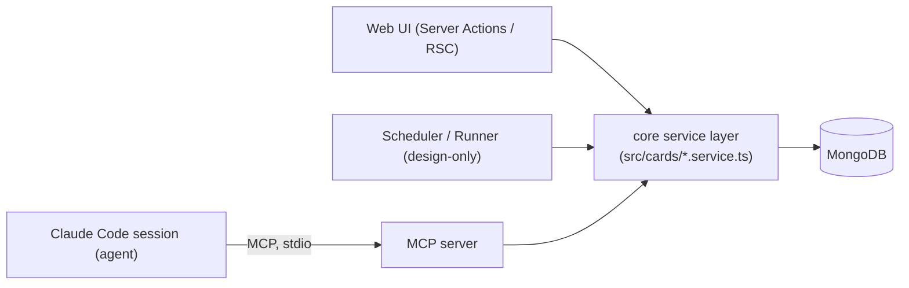

# Architecture

## Two surfaces over one service

The defining architectural idea: there is **one core service layer** (`src/cards/*.service.ts` — plain TS functions over MongoDB + Zod), exposed two ways.



- **Internal callers** (web UI Server Actions, and the design-only scheduler/runner) call the service functions **directly, in-process** — there is no internal HTTP API.
- **Agent sessions** reach the same functions through an **MCP server over stdio**. The MCP layer (`src/mcp/`) is a thin wrapper that re-exposes a safe subset and maps domain errors to tool results.

So "the API contract" is really the service function set; MCP just re-exposes part of it. See [api-mcp.md](./api-mcp.md).

## Two MCP servers (a deliberate evolution)

There are **two** MCP server builders, reflecting the ADR 0001 design shift. Both are real and tested:

1. **Card-scoped server** (`src/mcp/server.ts`, entry `src/mcp/index.ts`) — built with a `CARD_ID` (read from env at startup, fail-fast). Exposes exactly `get_my_task` / `set_my_status`, both implicitly bound to that one card. This is the *original* least-privilege model where one session = one card.
2. **Generic dispatch server** (`src/mcp/dispatch-server.ts`) — **no identity**, reads no env. Exposes `claim_card(id)` / `get_card_context(id)` / `set_status(id, …)` / `set_workspace(id, …)` — the card id is a **runtime argument**. This is the *current* Candidate 2′ model: a generic pre-started session is told which card to work via the `/ai-kanban-work-card <id>` skill, so it can't be `CARD_ID`-scoped. The tool registration (`registerDispatchTools`) is **transport-agnostic** and exposed two ways:
   - **stdio** — `src/mcp/dispatch-index.ts` (locally-spawned session).
   - **remote HTTP** — `POST /api/mcp` (`app/api/mcp/route.ts`, `createMcpHandler` / Streamable HTTP), gated by **HTTP Basic auth** (constant-time, single shared `MCP_BASIC_*` credential). This is the path a remote/phone-driven Claude Code session uses.

The generic server is the active path. The card-scoped server is retained (left intact, additive) and would fit a future identity-per-session mode. See [api-mcp.md](./api-mcp.md) for the transport + auth detail.

## Code vs. agent responsibility split

A core principle from [pool-dispatch.md](../docs/design/pool-dispatch.md): the boundary is drawn by *who is better at it*.

- **Code owns integrity** — operations that must be atomic/consistent/verifiable are MCP tools whose logic is deterministic: the atomic claim, status transitions (honoring the transition policy), reading context, persisting the *declared* workspace state (schema-validated). The agent **calls** these; it never reinvents them.
- **The agent owns the messy real world** — `git` and the filesystem (branch exists, worktree path occupied, dirty tree…). The agent runs `git` in its own shell, reads the real error, and recovers, guided by skill prose. **No code wraps `git`.** This is intentionally not auto-tested; correctness rides on the skill + model + the human steering the parked session.

## Per-card multi-repo workspace

One task can change several repos. Each card gets a folder under `workspaces/card-N/` (gitignored, created at runtime), with one git worktree per repo on branch `aikanban/card-N`. The agent creates the worktrees and then **declares** the resulting state via `set_workspace` (idempotent PUT — replaces, not appends). The card carries `workspacePath` + an embedded `repos[]` array.

## Web UI architecture

Strict RSC + Server Actions (no client data fetching). See [web-ui.md](../docs/design/web-ui.md) and [patterns.md](./patterns.md):

```mermaid
flowchart TD
  PAGE["app/page.tsx (RSC)<br/>reads searchParams + listTasks()"] --> BOARD["Board (client) + AddTaskDialog"]
  BOARD -->|drag drop / submit| ACT["Server Actions (actions.ts)<br/>moveCard / createTaskAction"]
  ACT --> SVC["service: updateTaskStatus / createTask"]
  ACT -->|revalidatePath('/')| PAGE
```

- Reads happen in the RSC that uses them; writes are Server Actions calling the same shared service functions.
- The UI uses the **human "any → any" status override** (`Caller.Ui`) — only the human can move a card along any edge; programmatic callers (agent) are constrained.
- Drag-to-move uses `@dnd-kit` + React `useOptimistic` (optimistic relocate, revert on action failure). URL state (`?new=task`) drives dialog open-state, handled server-side.

## Source layout

```
app/(board)/      Next.js board route: page wiring, Server Actions, *.ui.tsx, board logic
src/cards/        core domain: service, schemas, types, mapper, transition policy, claim,
                  workspace, counters, card_events audit, errors
src/db/           mongo connection, typed collections, parse-on-read wrappers (find-z), indexes
src/mcp/          two MCP servers + their tools + stdio entry points
src/components/ui shadcn components
src/test/         in-memory Mongo test harness
e2e/              Playwright board specs
docs/             design (authoritative), brainstorm (history), adr, research
```

## See also
- [data-models.md](./data-models.md) for collections, indexes, and concurrency patterns
- [patterns.md](./patterns.md) for the conventions that recur across these layers
